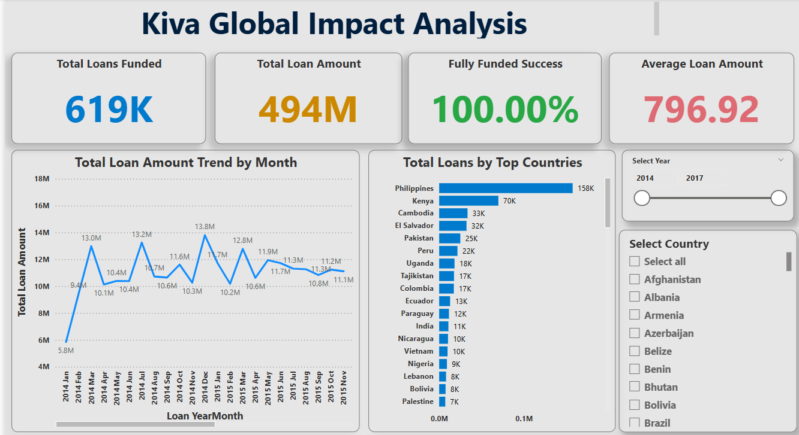
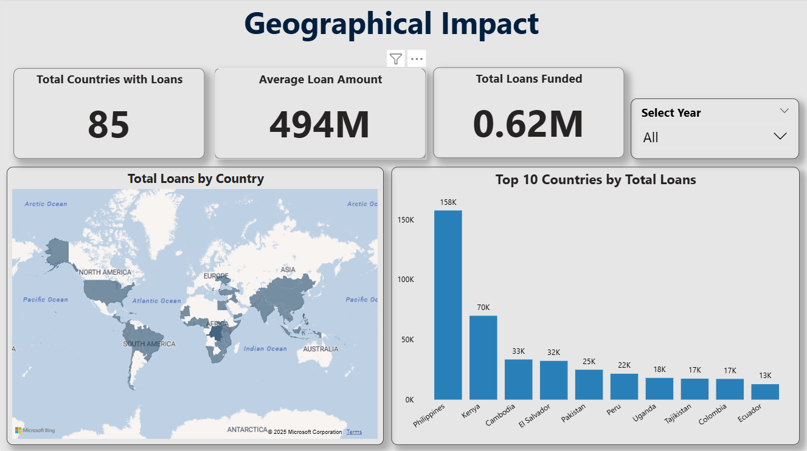
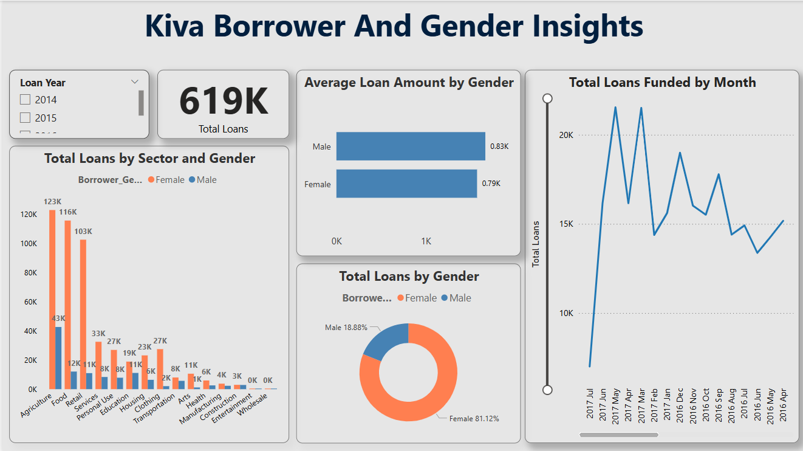
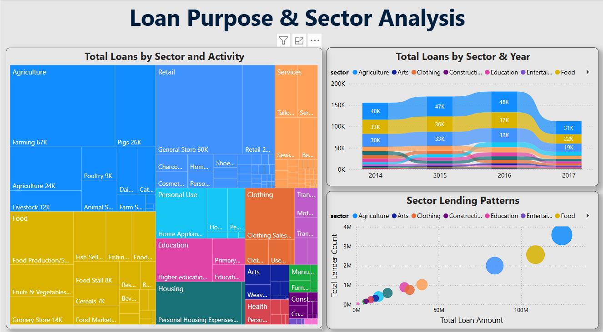
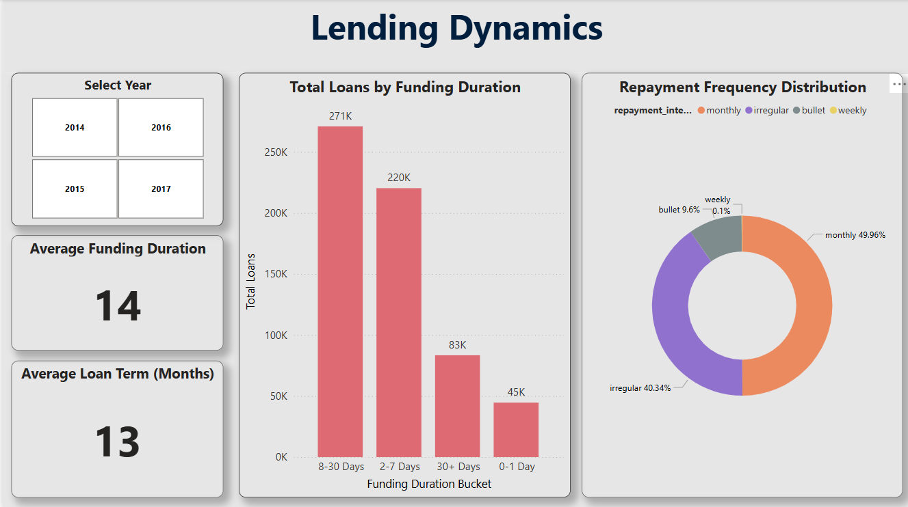

# Kiva Microloan Analysis: Geospatial & Socio-Economic Risk Insights

# Project Overview :

This project delivers a comprehensive end-to-end data analysis solution for Kiva Microloans, a global non-profit connecting lenders with entrepreneurs worldwide. The primary objective was to transform raw microloan data into actionable insights, focusing on understanding Kiva's operational dynamics, geographical impact, and the underlying factors contributing to lending patterns and potential risk.

Through rigorous SQL-driven data engineering and an interactive Power BI dashboard, this project provides a clear, data-driven narrative of Kiva's remarkable global footprint and its mission to foster financial inclusion.

# Key Features & Components :

This repository contains the artifacts from a full-cycle data analytics project:

Robust SQL Data Engineering (kiva_loans_sql_queries_results.md):

 Data Acquisition & Preparation: Ingested and meticulously cleaned raw Kiva loan data within MS SQL Server. This involved handling missing values, de-duplicating records, and performing crucial data type conversions (e.g., precise date formatting).

 Feature Engineering: Created derived columns such as time_to_fund_days and YearMonth keys directly in SQL, enhancing analytical capabilities.

 Advanced Querying: Utilized complex SQL techniques including CTEs (Common Table Expressions), Window Functions (ROW_NUMBER(), LAG()), and sophisticated JOIN operations to extract nuanced insights into loan performance, borrower demographics, and repayment patterns.

 Performance Optimization: Applied indexing strategies to ensure efficient query execution on large datasets.

# Dashboard Visualizations: 
Key insights from the Power BI dashboard are presented directly within this README via high-quality screenshots, offering an immediate overview of the analytical output.

Multi-Page Storytelling: The full Kiva_Microloan_Analysis_Dashboard.pbix file is included for deeper exploration, revealing a dynamic, multi-page dashboard that progresses from high-level summaries to granular insights, providing a cohesive data narrative.

Executive Summary: A concise overview of Kiva's global impact, highlighting total loans funded, loan amounts, and a consistent 100% funding success rate.

Geospatial Analysis: Visualized Kiva's worldwide reach with interactive maps, identifying top lending countries and their contributions.

Borrower & Gender Insights: Explored borrower demographics, emphasizing the significant impact on female entrepreneurs (over 81% of loans).

Sector & Purpose Deep Dive: Uncovered key sectors (e.g., Agriculture, Retail) and activities supported by Kiva, analyzing their evolution over time.

Lending Dynamics: Analyzed operational efficiency by visualizing funding duration and repayment frequency distributions.

Intuitive UX: Incorporated interactive slicers for dynamic filtering by Year, Country, Sector, and Gender, enhancing user exploration.

# Comprehensive Project Presentation (Kiva_Case_Study_Presentation.pptx):

A detailed PowerPoint presentation outlining the project objectives, SQL methodology, Power BI dashboard features, key insights, challenges faced, and actionable recommendations.

Presentation Link :

[(Kiva_Case_Study_Presentation.pptx)](https://github.com/git04/Kiva-Microloan-Analysis-SQL--POWER-BI/blob/main/Kiva_Case_Study_Presentation.pptx)

# Key Insights & Findings
The analysis revealed compelling insights into Kiva's operations:

100% Fully Funded Success: Consistently high funding success across all loans, underscoring the effectiveness of the Kiva platform.

Massive Global Impact: Over 619K loans totaling $494 Million have been funded across 85 countries, demonstrating Kiva's significant reach.

Female Empowerment at Core: A dominant 81.12% of loans are allocated to female borrowers, highlighting Kiva's crucial role in empowering women entrepreneurs worldwide.

Efficient Funding Cycles: Loans are funded relatively quickly, with an average funding duration of ~14 days, showcasing operational efficiency.

Diverse Sectoral Support: Significant lending activity in sectors like Agriculture, Retail, and Services, supporting a wide array of entrepreneurial ventures.

Dominant Repayment Intervals: Monthly and Irregular repayment intervals account for the vast majority of loans, reflecting adaptable financial structures.

Tools & Technologies
MS SQL Server: Data Storage, Cleaning, Transformation, Advanced Querying (CTE, Window Functions, Date Intelligence).

Power BI Desktop: Data Modeling, DAX, Interactive Dashboard Design, Data Visualization.

Power Query (M-Code): ETL Processes within Power BI.

Dashboard Visualizations

1. Kiva Global Impact Analysis (Overview)

2. Geographical Impact

3. Borrower & Gender Insights

4. Loan Purpose & Sector Analysis

5. Lending Dynamics & Repayment Patterns

